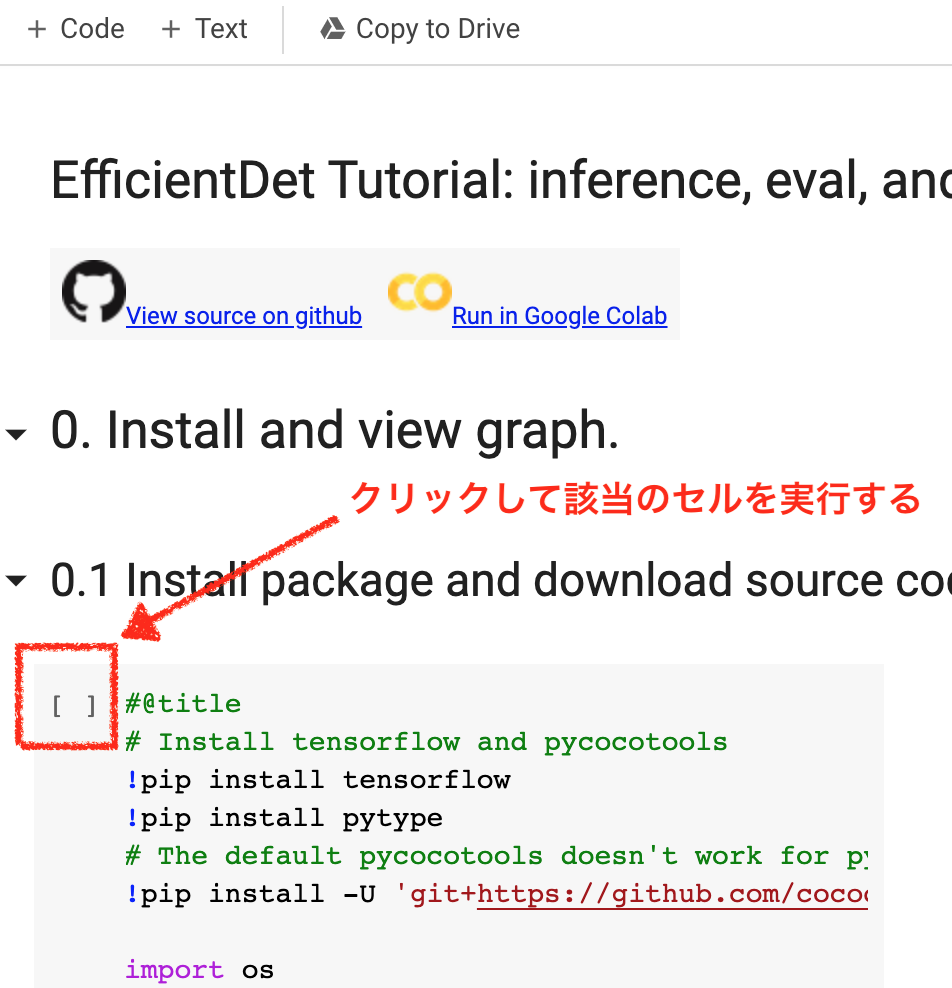
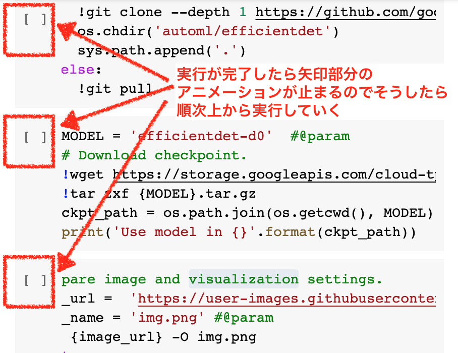

# JTPA みんなでやろうDL オンライン勉強会

* 全6回予定の隔週水曜日開催
* 初心者向け （但し DLをしっかりマスターするつもりの方）
* [Google Colab](https://colab.research.google.com/)を使ってオンラインでコードを実行し演習を行います
* 各回は前半45分と後半30分
* 前半はDLのフレームワークである[Keras](https://keras.io/ja/)を使って各種の簡単なDLモデルをJTPAのスタッフが実演／解説
* 後半はJTPAのギークサロンライクに特別ゲストをお呼びして、より深い技術分野や旬の話題をご解説頂きます
* 勉強会は Hangout Meetを用いてオンラインでの配信／参加 参加は無料／自由入退出OK
* 事前や事後の質問はissueを作って質問してもらうか、twitterにて [@Jiny2001](https://twitter.com/Jiny2001) と [@glory791days](https://twitter.com/glory791days) まで

 

勉強会開催後の次週はオンラインもくもく会です。自由にコードを書いて復習したり作ったものを皆に共有する時間として使って下さい。当日はJTPAスタッフが質問などにお答えします。

## 参加者管理 / 参加申請
https://www.meetup.com/JTPA-Japanese-Technology-Professionals-Association/

 

## Prerequisites / 参加のために必要なこと

本勉強会は皆が集まって勉強するのをJTPAスタッフ及び特別ゲストがサポートするというスタンスです。

Colabノートを使って理解した内容を適宜実行してML/DLの基本構造をよりよく理解することを目標としています。参加希望者数が多く、当日のスムーズな進行のために参加者様には事前に下記の確認をお願い致します。

0) __アンケート (ツールやMLに対しての事前知識の確認)__ [みんなでやろうDLの会　初回前アンケート](https://forms.gle/zumyqq5Y3vX3TPt58) への記入をお願い致します
 

1) __Python の基本構文を理解しておく__　不安のある方は [Pythonの基本文法まとめてやんよ!!!](http://tokidoki-web.com/2016/02/python%E3%81%AE%E5%9F%BA%E6%9C%AC%E6%96%87%E6%B3%95%E3%81%BE%E3%81%A8%E3%82%81%E3%81%A6%E3%82%84%E3%82%93%E3%82%88/)
 

2) __Google Colab ノートでセルの実行の仕方を理解しておく__

　下記のColabノートを開くと物体認識のDLモデルを実行できるノートが開きます。

[Google EfficientDet](https://colab.research.google.com/github/google/automl/blob/master/efficientdet/tutorial.ipynb)
 
下記画像にしたがって 1.1 Inference a single image まで実行できることをご確認お願い致します。

[Google Colaboratory（グーグルコラボ）の 使い方](https://pyhoo.jp/google-colaboratory-manual)

| | |
|---|---|
|||

 

## 当日利用する予定のツール

1) Hangout Meet (ミーティングURLは meetup.comにて参加予定者へ送付)

2) [イベント用チャットツール nocnoc (当日用のページ)](https://nocnoc.ooo/event/498A5C34-C242-4068-AC0C-4B06E168CFAB)
 (colabの実行についてやMLなどについての事前の質問はこちらへ)

3) [当日 進度確認／フィードバック用ツール CommentScreen ](https://commentscreen.com/comments?room=DL_together)

 

## Road map

|        | Date                | Title              | コースマテリアル             |特別ゲスト              |
|:------:|:-------------------:| :-----------------:|:-----------------:|:-----------------:|
| [Day 1](Day1_ML_Basic.md)  | 4/22/2020 (Wed) 9PM | ML/DLの基本原理を理解 |[TensorFlow, Keras and deep learning, without a PhD](https://codelabs.developers.google.com/codelabs/cloud-tensorflow-mnist/) 前半| [矢戸 知得](https://www.linkedin.com/in/chitoku-yato-01ba304/) 氏 (NVIDIA テクニカルマーケティング・マネジャー) |
| Day 1.5  | 4/29/2020 (Wed) 9PM | 復習用 もくもく会|
| [Day 2](Day2_CNN_and_more.md)  | 5/6/2020 (Wed) 9PM | CNN / Dropout / 他各種テクニック |[TensorFlow, Keras and deep learning, without a PhD](https://codelabs.developers.google.com/codelabs/cloud-tensorflow-mnist/) 後半| [山下 力也](https://www.linkedin.com/in/rikiya-yamashita/) 氏 (スタンフォード大 Department of Biomedical Data Science ポスドク) |
| Day 2.5  | 5/13/2020 (Wed) 9PM | 復習用 もくもく会|
| [Day 3](Day3_RNN.md)   | 5/20/2020 (Wed) 9PM | RNN / 時系列データ処理 | TBD | [数原 良彦](https://yoshi-suhara.com/) 氏 (Megagon Labs リサーチサイエンティスト) |
| Day 2.5  | 5/27/2020 (Wed) 9PM | 復習用 もくもく会|
| Day 4  |  | 強化学習? |  | TBD |
| Day 4.5  |  | 復習用 もくもく会|
| Day 5  |  |  | | TBD |
| Day 5.5  |  | 復習用 もくもく会|
| Day 6  |  |  | | TBD |
| Day 6.5  |  | 復習用 もくもく会|

 

### Google Colab とは？

Googleの提供する無料のクラウドサービスです。

自分の書いたPythonコードをGoogleの提供するサーバーやGPUを利用して実行できるだけでなく、Linuxのコマンドを実行して自由にモジュールをインストールすることができ、さらには自分のコードをGoogle Driveに保存したり他人と共有することができる大変便利なサービスです。

[Google Colaboratory（グーグルコラボ）の 使い方](https://pyhoo.jp/google-colaboratory-manual)

[codExa.net Google Colabの知っておくべき使い方](https://www.codexa.net/how-to-use-google-colaboratory/)

### Keras とは？

DL用のPythonフレームワークあるいはライブラリです。TensorflowやTheanoといった他のDLライブラリをまとめて簡単に実行できる中間APIと考えて差し支えないと思います。

[Keras: Pythonの深層学習ライブラリ](https://keras.io/ja/)

 

## スタッフ：
山中 仁 / Google, Research Engineer [@Jiny2001](https://twitter.com/Jiny2001)

西田 祐木 / Waymo, Software Engineer [@glory791days](https://twitter.com/glory791days)

運営：[JTPA (Japanese Technology Professionals Association) ](https://jtpa.org/)

 

## 全体お役立ちリンク

__MLの基礎用語・知識に自信がない方のための事前必読署：__

[ 機械学習を学習する by Google Cloud （漫画で分かるマシンラーニング）](https://cloud.google.com/products/ai/ml-comic-1/?hl=ja)

[ 機械学習を学習する by Google Cloud （漫画で分かるディープラーニング）](https://cloud.google.com/products/ai/ml-comic-2/?hl=ja)

__画像認識や人体ポーズ推定など、各種のDLモデルがColab上でオンラインで気軽に試せるプロジェクト：__

[tugstugi/dl-colab-notebooks](https://github.com/tugstugi/dl-colab-notebooks)

